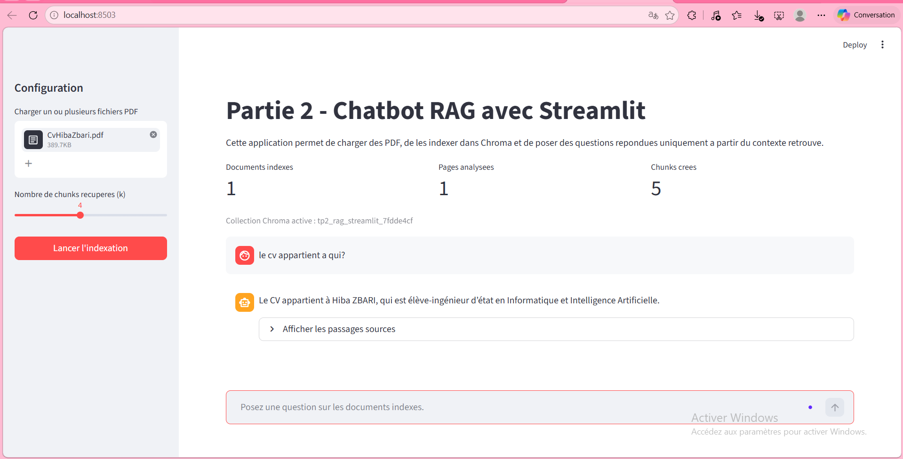
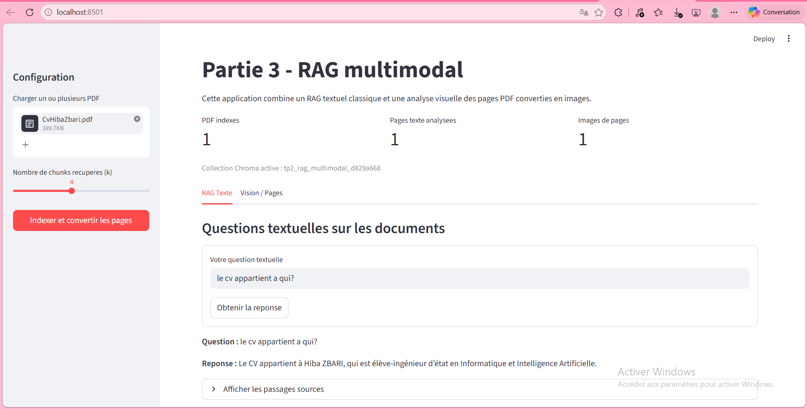

# Projet PFE - Assistant Intelligent basé sur RAG (LangChain & Streamlit)
Développé par Najoua Mouaddab
## Auteur
Najoua Mouaddab  

Encadrants : Mohamed YOUSSFI


## Introduction

Ce projet a été réalisé par Najoua Mouaddab . dans le cadre d'un **TP universitaire** consacre au **RAG (Retrieval-Augmented Generation)**.L’objectif du projet est de concevoir une application intelligente capable d’interroger des documents PDF à l’aide de techniques de Retrieval-Augmented Generation (RAG).Aveccharger des documents PDF ,extraire et indexer leur contenu 
, generer une reponse avec un modele de langage et le systeme peut aussi analyser visuellement les pages d'un document.

Le travail est organise en **trois parties complementaires** :

un **notebook Jupyter** pour experimenter les etapes fondamentales du pipeline RAG ;
une application **Streamlit** de type chatbot RAG ;
une application **multimodale** combinant RAG texte et analyse visuelle des pages PDF.

Le projet a ete pense pour rester **pedagogique, modulaire, clair et directement exploitable** dans un contexte d'apprentissage.

## Objectifs pedagogiques

Ce TP permet de manipuler concretement plusieurs notions importantes en intelligence artificielle appliquee :

- le **chargement et pretraitement** de documents ;
- le **decoupage du texte en chunks** ;
- la **vectorisation** via des embeddings ;
- l'utilisation d'une **base vectorielle** ;
- la **recherche d'information** avec un retriever ;
- la **generation assistee par contexte** avec un LLM ;
- les bases d'une approche **multimodale** combinant texte et image.

## Technologies utilisees

Le projet repose sur les outils suivants :

- **Python**
- **Jupyter Notebook**
- **Streamlit**
- **pypdf**
- **PyMuPDF** (`fitz`)
- **LangChain**
- **langchain-openai**
- **langchain-community**
- **langchain-text-splitters**
- **ChromaDB**
- **python-dotenv**
- **tiktoken**
- **Pillow**

## Modeles OpenAI utilises

Les applications et le notebook utilisent les modeles suivants :

- **Generation** : `gpt-4o-mini`
- **Embeddings** : `text-embedding-3-small`

Le projet suppose la presence d'une cle API OpenAI valide dans un fichier `.env`.

## Organisation generale du projet

```text
tp2-rag/
│── app.py
│── multimodal_app.py
│── requirements.txt
│── pyproject.toml
│── .env.example
│── README.md
│── chroma_db/
│── chroma_db_multimodal/
│── data/
│── notebooks/
│   └── tp2_rag.ipynb
```

## Description des fichiers principaux

### `notebooks/tp2_rag.ipynb`

Notebook Jupyter correspondant a la **Partie 1**. Il permet de tester pas a pas les composantes d'un pipeline RAG simple :

- chargement de PDF ;
- extraction du texte ;
- decoupage en chunks ;
- creation des embeddings ;
- stockage dans Chroma ;
- retrieval ;
- generation ;
- evaluation simple.

### `app.py`

Application Streamlit correspondant a la **Partie 2**. Elle implemente un **chatbot RAG** dans lequel l'utilisateur peut :

- televerser un ou plusieurs PDF ;
- lancer l'indexation ;
- choisir le nombre de chunks recuperes ;
- poser des questions ;
- obtenir une reponse generee uniquement a partir du contexte retrouve ;
- consulter les sources utilisees.

### `multimodal_app.py`

Application Streamlit correspondant a la **Partie 3**. Elle ajoute a la logique RAG texte :

- la conversion des pages PDF en images ;
- l'affichage des pages converties ;
- l'analyse visuelle d'une page selectionnee avec un modele multimodal.

### `requirements.txt`

Liste des dependances Python necessaires pour executer le projet.

### `.env.example`

Exemple minimal de fichier d'environnement contenant la variable `OPENAI_API_KEY`.

## Fonctionnalites du projet

## Partie 1 - Notebook RAG de base

Le notebook couvre les etapes suivantes :

1. **Initialisation**
2. **Chargement des documents**
3. **Indexing**
4. **Retrieval**
5. **Generation**
6. **Pipeline complet**
7. **Tests**
8. **Evaluation**

Fonctionnalites principales :

- verification du chargement de la cle API ;
- lecture d'un ou plusieurs fichiers PDF ;
- extraction du texte avec `pypdf` ;
- decoupage avec `RecursiveCharacterTextSplitter` ;
- creation d'une base vectorielle `Chroma` ;
- recuperation des chunks pertinents avec `k=4` ;
- generation de reponses en francais avec `gpt-4o-mini` ;
- evaluation qualitative simple.

## Partie 2 - Chatbot RAG avec Streamlit

L'application [app.py](C:/Users/PC/Desktop/AI/tp2-rag/app.py) propose une interface web simple et lisible pour manipuler un pipeline RAG.

Fonctionnalites principales :

- configuration de la page Streamlit ;
- sidebar pour televerser des PDF ;
- bouton de lancement de l'indexation ;
- message de progression pendant le traitement ;
- stockage du retriever dans `st.session_state` ;
- choix de la valeur `k` via un slider ;
- historique minimal des echanges ;
- affichage des passages sources dans un expander ;
- gestion des erreurs courantes.

Le prompt est concu pour obliger le modele a :

- repondre uniquement a partir du contexte ;
- signaler clairement quand l'information n'est pas trouvee ;
- eviter les hallucinations.

## Partie 3 - RAG multimodal

L'application [multimodal_app.py](C:/Users/PC/Desktop/AI/tp2-rag/multimodal_app.py) etend le projet en ajoutant une dimension visuelle.

Fonctionnalites principales :

- chargement des PDF ;
- extraction et indexation du texte ;
- conversion des pages PDF en images avec `fitz` ;
- stockage des images de pages dans `st.session_state.page_images` ;
- affichage des pages converties ;
- interface a deux onglets :
  `RAG Texte` et `Vision / Pages`
- question textuelle sur l'ensemble du document ;
- question visuelle sur une page selectionnee ;
- envoi d'une image encodee en base64 au modele.

Cette partie illustre l'interet du **RAG multimodal** pour des documents contenant :

- des schemas ;
- des tableaux ;
- des captures d'ecran ;
- des pages riches visuellement ;
- ou des informations mal representees par l'extraction texte seule.

## Prerequis

Avant de lancer le projet, il faut disposer de :

- Python installe sur la machine ;
- un environnement virtuel Python ;
- une cle API OpenAI valide ;
- au moins un fichier PDF de test.

## Installation

## 1. Se placer dans le dossier du projet

```powershell
cd C:\Users\PC\Desktop\AI\tp2-rag
```

## 2. Creer et activer un environnement virtuel

Avec `venv` :

```powershell
python -m venv .venv
.\.venv\Scripts\activate
```

Avec `uv` :

```powershell
uv venv
```

## 3. Installer les dependances

Avec `pip` :

```powershell
pip install -r requirements.txt
```

Avec `uv` :

```powershell
uv pip install -r requirements.txt
```

## 4. Configurer le fichier `.env`

Creer un fichier `.env` a la racine du projet a partir du modele [.env.example](C:/Users/PC/Desktop/AI/tp2-rag/.env.example) :

```env
OPENAI_API_KEY=your_openai_api_key_here
```

Important :

- ne pas mettre de guillemets ;
- ne pas ajouter d'espace autour du `=` ;
- verifier que la cle OpenAI est valide ;
- verifier que le fichier s'appelle bien `.env`.

## Execution

## Partie 1 - Notebook

Lancer Jupyter :

```powershell
jupyter notebook
```

Puis ouvrir :

[tp2_rag.ipynb](C:/Users/PC/Desktop/AI/tp2-rag/notebooks/tp2_rag.ipynb)

Pour tester correctement le notebook :

- placer un PDF dans [data](C:/Users/PC/Desktop/AI/tp2-rag/data), par exemple `data/document.pdf` ;
- executer les cellules dans l'ordre ;
- verifier que la cle API est bien chargee ;
- observer les chunks, les reponses generees et les sources.

## Partie 2 - Application Streamlit RAG

Lancer l'application :

```powershell
streamlit run app.py
```

Procedure de test :

1. ouvrir l'interface Streamlit dans le navigateur ;
2. charger un ou plusieurs PDF dans la barre laterale ;
3. choisir le nombre de chunks `k` ;
4. cliquer sur **Lancer l'indexation** ;
5. attendre la fin du traitement ;
6. poser une question sur les documents ;
7. verifier la reponse et les passages sources affiches.



## Partie 3 - Application Streamlit multimodale

Lancer l'application :

```powershell
streamlit run multimodal_app.py
```

Procedure de test :

1. charger un ou plusieurs PDF ;
2. cliquer sur **Indexer et convertir les pages** ;
3. attendre la creation de l'index texte et des images de pages ;
4. utiliser l'onglet **RAG Texte** pour poser une question textuelle ;
5. utiliser l'onglet **Vision / Pages** pour choisir une page et poser une question visuelle.



## Flux de traitement du projet

Le fonctionnement global du projet peut etre resume ainsi :

1. **Chargement des PDF**
2. **Extraction du texte**
3. **Nettoyage**
4. **Decoupage en chunks**
5. **Creation des embeddings**
6. **Indexation dans Chroma**
7. **Retrieval**
8. **Construction du contexte**
9. **Generation de reponse**
10. **Affichage de la reponse et des sources**

Dans la version multimodale, on ajoute :

11. **Conversion des pages PDF en images**
12. **Selection d'une page**
13. **Encodage en base64**
14. **Analyse visuelle par un modele multimodal**

## Conseils de test

Pour bien evaluer le projet, il est recommande de tester plusieurs types de questions :

- questions globales :
  `Quel est le sujet principal du document ?`
- questions de synthese :
  `Quels sont les points importants ?`
- questions precises :
  `Quelle est la conclusion du document ?`
- questions visuelles :
  `Que montre cette page ?`
  `Y a-t-il un tableau ou un schema visible ?`

## Depannage

## Probleme : cle API invalide

Si l'application affiche une erreur du type :

`401 invalid_api_key`

alors :

- le fichier `.env` est absent, mal nomme ou mal place ;
- ou bien la cle OpenAI n'est pas valide.

Verification rapide :

```powershell
.\.venv\Scripts\python.exe -c "from dotenv import load_dotenv; import os; load_dotenv(); k=os.getenv('OPENAI_API_KEY'); print(bool(k), k[:10] if k else None)"
```

## Probleme : aucun texte extrait du PDF

Ca peut arriver si :

- le PDF est scanne ;
- le PDF contient surtout des images ;
- le texte est difficilement extractible.

Dans ce cas, il faudrait idealement ajouter une etape OCR dans une version future.

## Probleme : reponses pauvres ou trop vagues

Ca peut venir de :

- chunks trop grands ou trop petits ;
- valeur `k` peu adaptee ;
- document difficile a segmenter ;
- faible qualite du texte extrait.

## Limites du projet

Cette implementation reste volontairement simple et pedagogique. Elle presente donc plusieurs limites :

- absence d'OCR pour les PDF scannes ;
- pas de reranking des chunks ;
- pas de citations automatiques formelles ;
- evaluation encore principalement qualitative ;
- historique de conversation minimal ;
- pas de prise en charge native d'autres formats comme DOCX.

## Interet du RAG multimodal

Le passage au multimodal est important car de nombreux documents reels ne sont pas uniquement textuels. Cette extension permet d'envisager :

- l'analyse de documents riches ;
- la prise en compte d'illustrations et de schemas ;
- l'inspection de tableaux ou captures d'ecran ;
- une meilleure robustesse face aux limites de l'extraction texte.

## Ameliorations possibles

Plusieurs extensions peuvent etre envisagees pour une version ulterieure :

- ajout d'une memoire conversationnelle ;
- support de formats supplementaires comme DOCX ;
- integration d'un OCR ;
- citations automatiques dans les reponses ;
- evaluation plus avancee du pipeline ;
- tableau de bord d'analyse des sources ;
- reranking des documents recuperes ;
- persistance plus fine des index ;
- comparaison de plusieurs modeles d'embeddings ;
- export des reponses generees.

## Valeur ajoutée

Ce projet met en œuvre une solution d’IA capable de :
- comprendre des documents complexes
- répondre avec contexte fiable
- réduire les hallucinations des modèles
